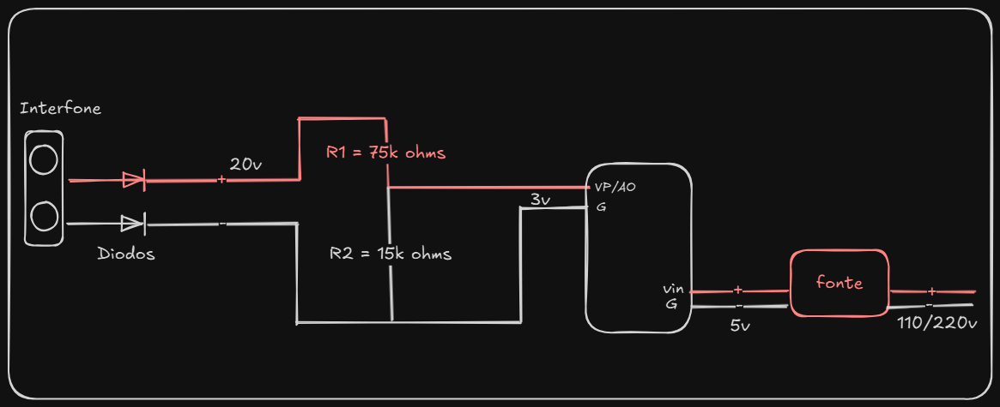

# Monitoramento de Tensão com ESP32 ou ESP8266 utilizando ADC

Este projeto utiliza um microcontrolador ESP32 ou ESP8266 para monitorar tensões analógicas e enviar notificações via WhatsApp usando a API CallMeBot. Este README detalha o funcionamento do ADC em ambos os microcontroladores e como eles são implementados neste projeto.

---

## Diagrama do Projeto



---

## Componentes do Sistema

1. **Interfone**:
   - A entrada de 20V no sistema pode ser proveniente do alto-falante do interfone ou da linha de entrada.
   - Conectado a dois diodos que servem para proteção e controle do fluxo de corrente.

2. **Diodos**:
   - Garantem que a corrente flua em uma única direção.
   - Protegem o circuito contra possíveis inversões de polaridade.

3. **Resistores**:
   - **R1 (75k ohms)** e **R2 (15k ohms)**: Formam um divisor de tensão, reduzindo os 20V do interfone para aproximadamente 3V, adequado para os pinos ADC do ESP32 ou ESP8266.

4. **ESP32 ou ESP8266**:
   - Recebe a tensão reduzida pelo divisor no pino ADC e mede a voltagem analógica.

5. **Fonte de Alimentação**:
   - Alimenta o microcontrolador com uma tensão de entrada de 5V nos pinos `vin` (positivo) e `G` (negativo).

---

## Funcionamento

- A entrada de 20V do interfone passa pelos diodos e é reduzida pelo divisor de tensão (composto por R1 e R2) para aproximadamente 3V.
- O ESP32 ou ESP8266 recebe os 5V nos pinos `vin` e `G` como fonte de alimentação.
- A fonte de alimentação é alimentada por uma rede elétrica de 110/220V, garantindo energia estável para o circuito.

Esse circuito integra com segurança o interfone ao microcontrolador, protegendo os componentes e estabilizando a tensão para uso.

---

## O que é o ADC?

ADC (Conversor Analógico para Digital) é um componente que converte sinais analógicos, como voltagem, em valores digitais que podem ser processados pelo microcontrolador.

---

## Diferenças entre o ADC do ESP32 e ESP8266

### ESP32
- **Resolução:** 12 bits (0 a 4095).
- **Canais ADC:** Dois ADCs (ADC1 e ADC2), com até 18 canais disponíveis.
- **Intervalo de Tensão:** 0V a 3.3V por padrão (configurável).
- **Recursos Adicionais:** Suporte a atenuação para ajustar a faixa de medição até 3.9V.

### ESP8266 (Puro)
- **Resolução:** 10 bits (0 a 1023).
- **Canais ADC:** Apenas um canal disponível (GPIO A0).
- **Intervalo de Tensão:** 0V a 1.0V por padrão (necessita divisor de tensão para sinais maiores).

### ESP8266 NodeMCU
- **Resolução:** 10 bits (0 a 1023).
- **Canais ADC:** Apenas um canal disponível (GPIO A0).
- **Intervalo de Tensão:** 0V a 3.3V por padrão.

---

## Configuração do ADC no Projeto

### Pino de Entrada Analógica
Neste projeto, utilizamos o pino GPIO 34 para o ESP32 ou o pino A0 para o ESP8266, ambos capazes de medir a voltagem analógica aplicada.

### Conversão de Valores
A leitura do ADC fornece um valor digital proporcional à tensão aplicada. A relação entre a leitura e a tensão nos microcontroladores é calculada como:

```c++
float voltageValue = (adcRead / 4095.0) * 3.3; // Para ESP32
float voltageValue = (adcRead / 1023.0) * 1.0; // Para ESP8266 puro
float voltageValue = (adcRead / 1023.0) * 3.3; // Para ESP8266
```

- **adcRead:** Valor digital lido do ADC.
- **3.3 ou 1.0:** Voltagem de referência (dependendo do microcontrolador e configuração).

---

## Envio de Notificações

### Integração com o CallMeBot
O projeto utiliza a API CallMeBot para enviar notificações via WhatsApp. Sempre que a tensão lida exceder 2V, o microcontrolador envia uma mensagem contendo o valor da tensão.

### Fluxo do Projeto
1. O ESP32 ou ESP8266 mede a tensão analógica usando o ADC.
2. Converte o valor lido em uma tensão real.
3. Caso a voltagem seja maior que 2V, envia uma notificação via CallMeBot.

### Requisitos
- Rede Wi-Fi configurada.
- Chave de API válida da CallMeBot.

---

## Links Úteis

- [Artigo sobre ADC no ESP32/ESP8266](https://microcontrollerslab.com/esp32-esp8266-adc-micropython-measure-analog-readings/)
- [CallMeBot WhatsApp API](https://www.callmebot.com/)

---

Com este projeto, é possível monitorar sinais analógicos e receber alertas em tempo real, explorando as capacidades do ESP32 ou ESP8266 no mundo da IoT.
